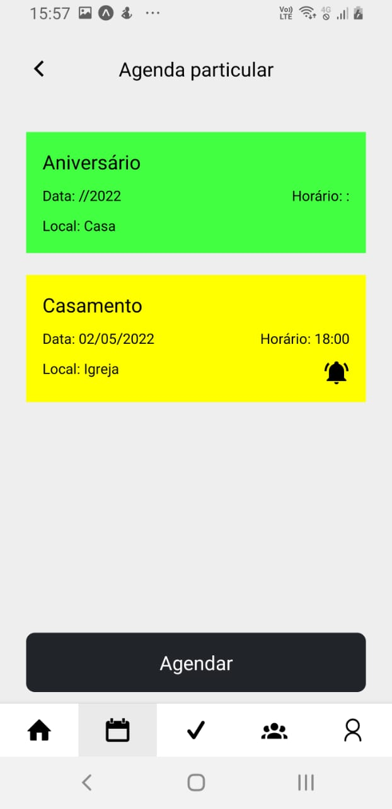
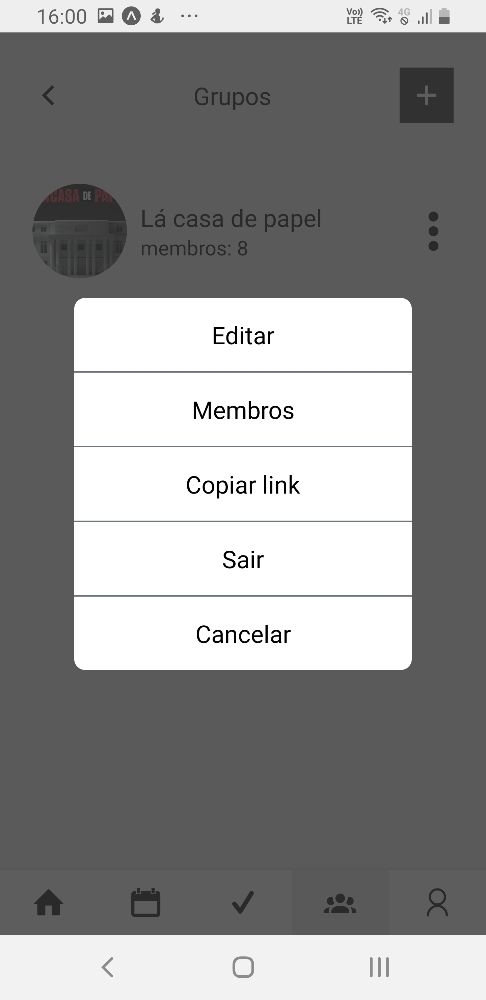
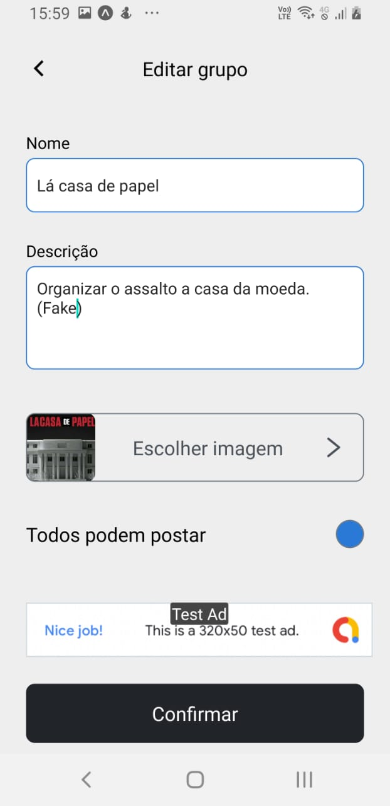
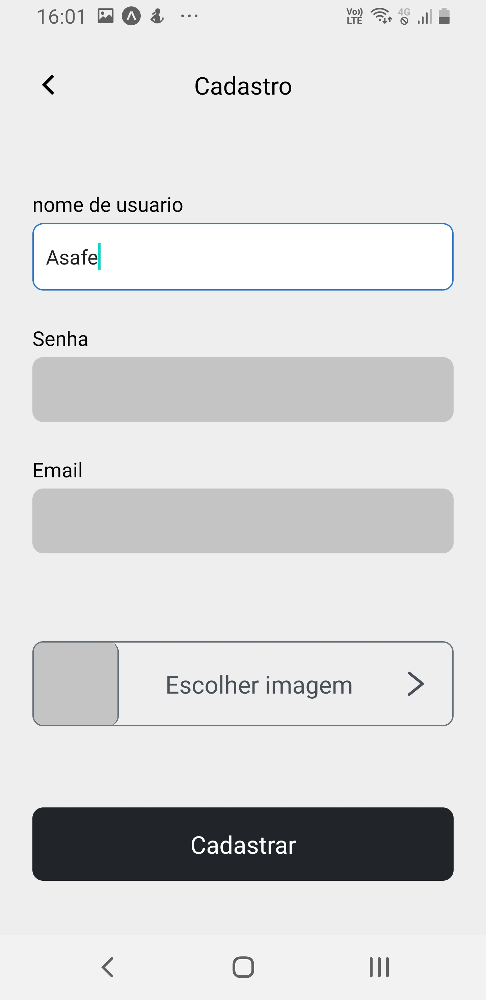

# Tasks manager
An adroid and ios app that will help you to organize your tasks and schedules. (react native and expo).

## Home

## schedules

## concluded tasks

## List of groups

## Group options

## Edit group
* The screen to create a group is almost the same.

## Group tasks

## Group members

## Profile

## Edit profile

## Sign in

## Register

## Settings
